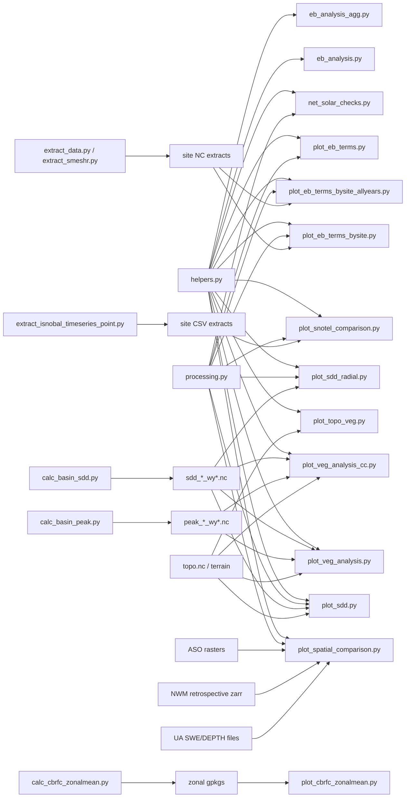

# UCRB iSnobal Plotting Script Audit

Scope: Python plotting scripts in `ucrb-isnobal/scripts` only.

## Plotting Scripts and What They Do

| Script | Primary purpose | Main inputs | Main outputs | Key associations |
|---|---|---|---|---|
| `scripts/plot_spatial_comparison.py` | Compares iSnobal against ASO, NWM, and UA spatially; builds maps/histograms and terrain-bin summaries. | iSnobal run `snow.nc`, ASO rasters, NWM zarr/S3, UA files, basin shapefile. | PNG map/hist figures, diff NetCDF, terrain stats CSV. | Imports `helpers` and `processing`; consumes outputs from ASO preprocessing and model run directories. |
| `scripts/plot_sdd.py` | Computes/plots SDD maps, shift maps, histograms, and terrain-conditioned SDD summaries. | Per-run SDD NetCDF (`*_sdd_*`), terrain rasters/topo, WY metadata. | Multiple PNGs, SDD shift NetCDF, CSV summaries by elevation/DOY. | Depends on SDD products produced by `calc_basin_sdd.py`; imports `helpers` and `processing`. |
| `scripts/plot_sdd_radial.py` | Polar/radial visualization of SDD shift by aspect and elevation bins. | SDD shift NetCDF, terrain NetCDF (`dem`, `aspect`). | Radial PNG plot. | Uses SDD shift produced by `plot_sdd.py`; imports `helpers` and `processing`. |
| `scripts/plot_snotel_comparison.py` | Site time-series comparison of SNOTEL depth vs Baseline and HRRR-MODIS/HRRR-SPIReS extracts. | SNOTEL metadata/series plus extracted model CSVs. | Site stack PNG figure. | Uses CSV products from extraction workflow (notably `extract_isnobal_timeseries_point.py`). |
| `scripts/plot_eb_terms.py` | Legacy site-by-site energy-balance plots; can also extract and persist EM point NetCDF. | Model `em.nc` files at SNOTEL points. | Per-site PNG figures and optional extracted NetCDF. | Shares prep/trim/plot logic with newer EB scripts. |
| `scripts/plot_eb_terms_bysite.py` | Daily EB components by SNOTEL site for one WY (Baseline vs HRRR-SPIReS). | Site-extracted EB/net solar NetCDF files. | Per-site daily EB PNG figures. | Imports `helpers` and `processing`; functional successor to `plot_eb_terms.py`. |
| `scripts/plot_eb_terms_bysite_allyears.py` | Multi-WY concatenated EB plots by site (single figure per site spanning WY range). | Multi-year site extract NetCDF files. | Per-site all-years PNG figures. | Same logic family as `plot_eb_terms_bysite.py`, with concat/reordering helpers. |
| `scripts/eb_analysis.py` | Publication-style EB diagnostics by condition for each site (6 figure types per site). | EM CSV exports, net solar CSVs, condition windows. | 6 PNGs per site per basin/WY. | Standalone plotting workflow using `helpers`; overlaps strongly with `eb_analysis_agg.py`. |
| `scripts/eb_analysis_agg.py` | Aggregate/site-grid version of `eb_analysis.py` (6 total figure types for all sites). | Same inputs as `eb_analysis.py`. | 6 PNGs per basin/WY across all sites. | Structural sibling of `eb_analysis.py` with shared conditioning/math patterns. |
| `scripts/net_solar_checks.py` | Diagnostic plotting for net radiation, net solar, DSWRF, and albedo at SNOTEL sites. | `em.nc`, energy balance/net_solar files, site metadata. | Multiple PNG diagnostic families. | Reuses the same SNOTEL prep and time-alignment patterns as EB plot scripts. |
| `scripts/energy_balance_check.py` | Quick-look spatial panel of EB terms for a selected date. | Date-specific `em.nc` from model runs. | Single panel PNG. | Independent lightweight checker; duplicates local helper logic (`fn_list`). |
| `scripts/plot_topo_veg.py` | Maps and histograms of topo-derived LANDFIRE vegetation fields. | `topo.nc` from basin setup. | Two PNGs (maps + hists). | Uses `helpers.plot_one`; often paired with veg analysis scripts. |
| `scripts/plot_veg_analysis.py` | Exploratory hist/heat/median-shift analyses linking snow metric outputs to vegetation classes. | Calculated snow metric NetCDF (`sdd`/`peak`), topo vegetation variables. | Multiple PNG exploratory plots. | Shares directory-resolution and style code with `plot_veg_analysis_cc.py`; uses outputs from `calc_basin_sdd.py` / `calc_basin_peak.py`. |
| `scripts/plot_veg_analysis_cc.py` | Variant of veg analysis using canopy-cover products (hexbin/regression against SDD). | SDD/peak products, DEM/topo, canopy-cover rasters. | Hexbin/regression PNG outputs. | Fork-like companion to `plot_veg_analysis.py`; extends with canopy-cover reprojection/matching. |
| `scripts/plot_cbrfc_zonalmean.py` | Time-series comparison of iSnobal zonal means against CBRFC SNOW-17 zone data. | Zonal GeoPackage products + CBRFC CSVs. | Per-zone PNG comparisons. | Consumes output generated by `calc_cbrfc_zonalmean.py`. |
| `scripts/plot_diff_veg_topo.py` | Intended to plot snow-difference vs veg/slope classes from topo + diff NetCDF. | Difference NetCDF + topo variables/slope bins. | Intended boxplot outputs. | Currently incomplete in main plotting section; scaffolding present. |
| `scripts/plot_timeseries.py` | Intended basin-wide depth timeseries workflow (SNOTEL/NWM/SWANN orchestration). | SNOTEL, NWM, SWANN, basin polygons. | Currently writes SWANN CSV; plotting is mostly TODO/partial. | Appears partially implemented and currently mixes extraction with plotting intent. |

## Interaction Diagram



## Significant Overlap and Potential Refactor Targets (notes only)

1. Repeated SNOTEL site-prep logic (High overlap)
- Same pattern appears as `prep_snotel_sites`/`pull_snotel_sites` in multiple files.
- Evidence: `plot_eb_terms.py`, `plot_eb_terms_bysite.py`, `plot_eb_terms_bysite_allyears.py`, `plot_snotel_comparison.py`, `net_solar_checks.py`, and extraction scripts.
- Risk: drift in site filtering/buffer/EPSG behavior.

2. Repeated plotting style/bootstrap code (Medium)
- Similar palette setup and matplotlib rc defaults repeated across scripts.
- Evidence: `plot_veg_analysis.py` and `plot_veg_analysis_cc.py` duplicate font/rc block; multiple scripts repeat `sns.set_palette(...)` and similar axis formatting.
- Risk: inconsistent figure appearance between scripts after small edits.

3. Repeated directory/path resolution patterns (High)
- Multiple scripts hardcode `workdir`, `script_dir`, ancillary paths and basin/WY glob logic.
- Evidence across nearly every plotting entrypoint (`plot_spatial_comparison.py`, `plot_sdd.py`, `plot_snotel_comparison.py`, EB scripts, veg scripts).
- Risk: brittle portability and frequent breakage when filesystem layout changes.

4. Overlapping EB plotting families (High)
- `plot_eb_terms.py`, `plot_eb_terms_bysite.py`, `plot_eb_terms_bysite_allyears.py`, `net_solar_checks.py`, `eb_analysis.py`, and `eb_analysis_agg.py` all perform related site/flux plotting with duplicated conditioning and subplot logic.
- Risk: duplicated bug fixes and metric mismatches over time.

5. `plot_veg_analysis.py` vs `plot_veg_analysis_cc.py` fork-style overlap (High)
- Shared scaffolding (`get_dirs_filenames`, arg parsing shape, style setup), with one adding canopy-cover workflow.
- Risk: divergent behavior for shared operations (same inputs, different conventions).

6. Repeated axis helper utilities (Low/Medium)
- Local `clean_axes` redefined in multiple scripts despite available helper utilities.
- Risk: minor inconsistency and unnecessary maintenance overhead.

7. Script maturity inconsistency (Important cleanup flag)
- `plot_diff_veg_topo.py` has setup but unfinished plotting body.
- `plot_timeseries.py` is marked plotting but currently acts mostly as extraction/prep with TODOs.
- `eval_metrics.py` is largely commented prototype code, not an active plotting script.

## Ranked Refactor Roadmap

This roadmap is ordered by expected maintenance payoff relative to implementation risk. It is still a planning artifact only; no refactor is being proposed or applied here.

| Rank | Refactor target | Why it ranks here | Primary scripts affected | Expected payoff | Risk |
|---|---|---|---|---|---|
| 1 | Centralize SNOTEL site-prep and basin/site discovery | The same logic is copied across both plotting and extraction workflows, so every behavior change currently fans out into many files. | `plot_snotel_comparison.py`, `plot_eb_terms.py`, `plot_eb_terms_bysite.py`, `plot_eb_terms_bysite_allyears.py`, `net_solar_checks.py`, `extract_data.py`, `extract_smeshr.py` | Removes highest-volume duplication and reduces drift in site selection. | Low to medium |
| 2 | Centralize filesystem/config path resolution | Hardcoded paths are the main portability and maintenance bottleneck across the whole plotting stack. | Nearly all plotting entrypoints, especially `plot_spatial_comparison.py`, `plot_sdd.py`, `plot_snotel_comparison.py`, EB scripts, veg scripts | Makes scripts relocatable and reduces path-edit churn. | Medium |
| 3 | Consolidate EB plotting family into shared plot utilities | The EB scripts are the densest duplication cluster and already operate on nearly identical concepts and file products. | `plot_eb_terms.py`, `plot_eb_terms_bysite.py`, `plot_eb_terms_bysite_allyears.py`, `net_solar_checks.py`, `eb_analysis.py`, `eb_analysis_agg.py` | Major reduction in repeated plotting loops, legends, axis setup, and site iteration. | Medium |
| 4 | Merge or rebase the vegetation-analysis fork | `plot_veg_analysis.py` and `plot_veg_analysis_cc.py` share scaffolding and differ mainly in data source/extensions. | `plot_veg_analysis.py`, `plot_veg_analysis_cc.py` | Simplifies maintenance of exploratory snow/veg analyses. | Medium |
| 5 | Move shared plotting style/bootstrap into one module | Repeated `sns.set_palette`, `plt.rc(...)`, and figure formatting produce avoidable visual drift. | Veg scripts, spatial scripts, SDD scripts, EB scripts | Consistent figures and faster future plotting additions. | Low |
| 6 | Standardize CLI/argument parsing patterns | Argument parsing is repeated with mostly similar basin/WY/palette/outdir conventions. | Most scripts with `parse_arguments()` | Easier onboarding and fewer interface inconsistencies. | Low |
| 7 | Clarify incomplete/prototype scripts | Some files are half-plotter, half-extractor, or mostly commented notebook ports. | `plot_diff_veg_topo.py`, `plot_timeseries.py`, `eval_metrics.py` | Reduces ambiguity in what is production-ready. | Low |

### 1. Centralize SNOTEL Site-Prep and Basin/Site Discovery

- Priority: Highest
- Rationale: This is the most repeated operational workflow in the repo and affects both extraction and plotting. Fixing or changing basin polygon logic, EPSG handling, or buffer rules currently requires synchronized edits across many files.
- Candidate shared responsibilities:
  - Find basin polygon from basin name.
  - Load/transform SNOTEL site locations.
  - Filter sites inside buffered basin geometry.
  - Resolve site numbers, names, and state abbreviations.
  - Return both site metadata and metloom data in a stable structure.
- Evidence cluster:
  - `prep_snotel_sites` in `plot_eb_terms.py`, `plot_eb_terms_bysite.py`, `plot_eb_terms_bysite_allyears.py`, `net_solar_checks.py`, `extract_data.py`, `extract_smeshr.py`
  - `pull_snotel_sites` in `plot_snotel_comparison.py`
- Suggested end-state:
  - One shared helper in `processing.py` or a dedicated `site_utils.py` layer used by both extractors and plotters.

### 2. Centralize Filesystem and Path Configuration

- Priority: Very high
- Rationale: Hardcoded group paths are spread across the plotting stack and are a larger practical pain point than plotting logic itself. This is the refactor most likely to improve day-to-day usability.
- Candidate shared responsibilities:
  - Model run root directories.
  - Basin setup/script directories.
  - Ancillary data roots for SNOTEL, ASO, NWM, UA, SWANN, CBRFC.
  - Default figure output roots.
- Evidence cluster:
  - Hardcoded path setup appears in `plot_spatial_comparison.py`, `plot_sdd.py`, `plot_snotel_comparison.py`, `plot_timeseries.py`, EB scripts, and veg scripts.
- Suggested end-state:
  - One config module or YAML/INI source that scripts import rather than embedding paths inline.

### 3. Consolidate the Energy-Balance Plotting Family

- Priority: Very high
- Rationale: The EB scripts are doing related work with repeated site loops, repeated time alignment, repeated legend placement, and repeated subplot assembly. This cluster likely yields the largest code reduction after site-prep centralization.
- Candidate shared responsibilities:
  - Align/resample EB datasets.
  - Shared site subplot grid builder.
  - Common axis formatting, limits, grid styling, legends.
  - Shared flux family definitions and label mappings.
  - Shared conditional-period handling for melt/cold snap/freezing windows.
- Evidence cluster:
  - `plot_eb_terms.py` and `plot_eb_terms_bysite.py` overlap in site iteration and EB plotting.
  - `plot_eb_terms_bysite_allyears.py` extends the same pattern with concat helpers.
  - `net_solar_checks.py` reuses the same SNOTEL/time-alignment family for a narrower diagnostic purpose.
  - `eb_analysis.py` and `eb_analysis_agg.py` share almost identical condition-building and figure generation logic.
- Suggested end-state:
  - A reusable `eb_plotting.py` or `plotting_utils/energy_balance.py` layer with thin entrypoint scripts on top.

### 4. Merge or Rebase the Vegetation Analysis Fork

- Priority: High
- Rationale: The vegetation scripts are a classic fork pattern: common setup and plotting structure, one script adding canopy-cover-specific behavior. This tends to drift unless intentionally recombined.
- Candidate shared responsibilities:
  - Shared basin/WY directory resolution.
  - Shared style setup.
  - Shared snow metric loading.
  - Shared figure naming/output rules.
  - Optional extension hooks for canopy-cover workflows.
- Evidence cluster:
  - `plot_veg_analysis.py` and `plot_veg_analysis_cc.py` both define similar setup, parsing, and directory functions.
- Suggested end-state:
  - One base analysis module plus optional canopy-cover mode or secondary wrapper script.

### 5. Standardize Plot Style and Axis Utilities

- Priority: Medium
- Rationale: This is not the highest maintenance burden, but it is low-risk and improves consistency across all figures.
- Candidate shared responsibilities:
  - Palette initialization.
  - Font/rc defaults.
  - Common `clean_axes` behavior.
  - Shared legend placement and grid styling.
- Evidence cluster:
  - Duplicate `clean_axes` implementations and repeated `plt.rc(...)` / `sns.set_palette(...)` patterns.
- Suggested end-state:
  - One small shared plotting-style module consumed by all figure scripts.

### 6. Standardize CLI Patterns

- Priority: Medium
- Rationale: Nearly every script redefines a similar `parse_arguments()` interface. This is low-risk cleanup that improves predictability, especially for scripts that work on the same basin/WY/outdir model.
- Candidate shared responsibilities:
  - Common basin/WY arguments.
  - Common `--outdir`, `--palette`, `--verbose`, `--overwrite` options.
  - Common path/config overrides.
- Evidence cluster:
  - Repeated `parse_arguments()` functions across almost all active scripts.
- Suggested end-state:
  - Shared argument-builder helpers or a small wrapper around `argparse`.

### 7. Separate Production Scripts from Prototypes and Incomplete Work

- Priority: Medium for clarity, lower for code-health impact
- Rationale: Some files create uncertainty about whether they are active production tools, prototypes, or unfinished conversions from notebooks.
- Focus files:
  - `plot_diff_veg_topo.py`
  - `plot_timeseries.py`
  - `eval_metrics.py`
- Suggested actions to consider later:
  - Mark explicitly as prototype/archive/incomplete.
  - Finish and promote them to active scripts.
  - Or move them into an archival/prototype location.

## Recommended Sequencing

### Phase 1: Stabilize shared operational plumbing

1. Centralize SNOTEL/basin/site discovery.
2. Centralize path/config resolution.

Why first:
- These changes reduce duplication across both extraction and plotting layers.
- They also lower the cost of later refactors because file discovery and site resolution become stable interfaces.

### Phase 2: Collapse the largest plotting duplication clusters

1. Consolidate EB plotting utilities.
2. Rebase the vegetation-analysis fork.

Why second:
- These are the two most obvious script-family duplications after shared plumbing is addressed.

### Phase 3: Standardize the developer interface

1. Move style/bootstrap into shared helpers.
2. Standardize CLI conventions.

Why third:
- Helpful and low-risk, but less urgent than the functional duplication in Phases 1 and 2.

### Phase 4: Clean script maturity boundaries

1. Decide whether incomplete/prototype scripts should be finished, archived, or relabeled.

Why last:
- This improves clarity, but it is mostly organizational compared with the higher-impact duplication above.

## Best Candidate Starting Points

If only one refactor stream were started later, the strongest entry points would be:

1. Shared SNOTEL site-prep utility
- Highest cross-cutting value.
- Touches plotting and extraction together.

2. EB plotting utility layer
- Highest script-family duplication reduction.
- Would simplify the most actively overlapping plotting scripts.

3. Central config/path module
- Highest operational robustness gain for daily use on CHPC/shared filesystems.

## Concrete Implementation Plan

This section turns the roadmap into a proposed target structure and an execution sequence that can be implemented incrementally without forcing a full rewrite.

### Target Architecture

Recommended approach: keep the existing script entrypoints in `scripts/`, but move duplicated logic into a small set of importable support modules.

Recommended new modules:

| Proposed module | Purpose | Why this boundary makes sense |
|---|---|---|
| `ucrb_isnobal_refactor/config.py` | Centralize paths, default output dirs, and common environment settings. | Path duplication is cross-cutting and should be solved once. |
| `ucrb_isnobal_refactor/sites.py` | Basin polygon lookup, SNOTEL site discovery, EPSG handling, metloom fetch orchestration. | This is the most duplicated operational workflow across plotters and extractors. |
| `ucrb_isnobal_refactor/io_paths.py` | Basin/WY model directory discovery, standard filename builders, output naming helpers. | Many scripts repeat the same `basin` + `WY` path globbing logic. |
| `ucrb_isnobal_refactor/plot_style.py` | Shared seaborn/matplotlib setup and axis cleanup helpers. | Central place for palette, rcParams, legend conventions, and `clean_axes`. |
| `ucrb_isnobal_refactor/cli.py` | Shared argument-parser builders for basin/WY/outdir/palette/overwrite/verbose patterns. | Reduces repetitive `argparse` definitions while preserving per-script specialization. |
| `ucrb_isnobal_refactor/energy_balance.py` | Data prep and plotting helpers for EB scripts. | EB plotting is the densest duplication cluster. |
| `ucrb_isnobal_refactor/vegetation.py` | Shared veg/topo loading and snowmetric-vs-veg analysis helpers. | Captures the common base behind `plot_veg_analysis*` and `plot_topo_veg.py`. |
| `ucrb_isnobal_refactor/sdd.py` | Shared SDD loading, masking, difference calculation, and terrain binning helpers. | `plot_sdd.py` and `plot_sdd_radial.py` operate on the same products. |
| `ucrb_isnobal_refactor/spatial_compare.py` | Higher-level helpers for ASO/NWM/UA/iSnobal comparison workflows. | `plot_spatial_comparison.py` is large enough to justify its own support layer. |
| `ucrb_isnobal_refactor/status.py` | Optional helper/constants for marking active, incomplete, archived, or prototype scripts. | Useful for managing partial scripts without deleting them immediately. |

Recommended filesystem shape:

```text
ucrb-isnobal/
  scripts/
    plot_*.py
    calc_*.py
    extract_*.py
  ucrb_isnobal_refactor/
    __init__.py
    config.py
    io_paths.py
    cli.py
    plot_style.py
    sites.py
    energy_balance.py
    vegetation.py
    sdd.py
    spatial_compare.py
    status.py
```

This keeps script invocation stable while moving implementation logic behind importable modules.

### Anticipated Final Refactored Code Diagram

```mermaid
flowchart TB
  subgraph EntryPoints[CLI Entry Points in scripts/]
    S1[plot_snotel_comparison.py]
    S2[plot_eb_terms.py]
    S3[plot_eb_terms_bysite.py]
    S4[plot_eb_terms_bysite_allyears.py]
    S5[net_solar_checks.py]
    S6[eb_analysis.py]
    S7[eb_analysis_agg.py]
    S8[plot_sdd.py]
    S9[plot_sdd_radial.py]
    S10[plot_topo_veg.py]
    S11[plot_veg_analysis.py]
    S12[plot_veg_analysis_cc.py]
    S13[plot_spatial_comparison.py]
    S14[plot_cbrfc_zonalmean.py]
  end

  subgraph SharedLayer[ucrb_isnobal_refactor Shared Modules]
    C[config.py]
    I[io_paths.py]
    L[cli.py]
    PS[plot_style.py]
    ST[sites.py]
    EB[energy_balance.py]
    SD[sdd.py]
    VG[vegetation.py]
    SC[spatial_compare.py]
    XS[status.py]
  end

  subgraph ExistingCore[Existing Core Utilities]
    H[env/helpers.py]
    P[processing.py]
  end

  subgraph Producers[Upstream Data Producers]
    CBSDD[calc_basin_sdd.py]
    CBPEAK[calc_basin_peak.py]
    CCBRFC[calc_cbrfc_zonalmean.py]
    EIP[extract_isnobal_timeseries_point.py]
    ED[extract_data.py]
    ESM[extract_smeshr.py]
  end

  subgraph DataProducts[Standardized Data Products]
    D1[sdd and sdd_shift NetCDF]
    D2[peak NetCDF]
    D3[site CSV extracts]
    D4[site NC extracts]
    D5[zonal GeoPackages and CSVs]
    D6[topo.nc and terrain rasters]
    D7[ASO / NWM / UA / SWANN external products]
  end

  S1 --> L
  S1 --> ST
  S1 --> I
  S1 --> PS

  S2 --> L
  S2 --> ST
  S2 --> I
  S2 --> PS
  S2 --> EB

  S3 --> L
  S3 --> ST
  S3 --> I
  S3 --> PS
  S3 --> EB

  S4 --> L
  S4 --> ST
  S4 --> I
  S4 --> PS
  S4 --> EB

  S5 --> L
  S5 --> ST
  S5 --> I
  S5 --> PS
  S5 --> EB

  S6 --> L
  S6 --> I
  S6 --> PS
  S6 --> EB

  S7 --> L
  S7 --> I
  S7 --> PS
  S7 --> EB

  S8 --> L
  S8 --> I
  S8 --> PS
  S8 --> SD

  S9 --> L
  S9 --> I
  S9 --> PS
  S9 --> SD

  S10 --> L
  S10 --> I
  S10 --> PS
  S10 --> VG

  S11 --> L
  S11 --> I
  S11 --> PS
  S11 --> VG

  S12 --> L
  S12 --> I
  S12 --> PS
  S12 --> VG

  S13 --> L
  S13 --> I
  S13 --> PS
  S13 --> SC

  S14 --> L
  S14 --> I
  S14 --> PS
  S14 --> SC

  C --> I
  C --> ST
  C --> EB
  C --> SD
  C --> VG
  C --> SC

  ST --> H
  ST --> P
  EB --> H
  EB --> P
  SD --> H
  SD --> P
  VG --> H
  VG --> P
  SC --> H
  SC --> P

  CBSDD --> D1
  CBPEAK --> D2
  EIP --> D3
  ED --> D4
  ESM --> D4
  CCBRFC --> D5

  D1 --> SD
  D2 --> VG
  D3 --> ST
  D4 --> EB
  D5 --> SC
  D6 --> SD
  D6 --> VG
  D7 --> SC
```



Interpretation:

1. `scripts/` remains the stable CLI surface.
2. `ucrb_isnobal_refactor/` becomes the shared implementation layer.
3. `env/helpers.py` and `processing.py` remain foundational utilities, but script-specific duplication moves above them into domain-specific shared modules.
4. Upstream `calc_*` and `extract_*` scripts continue producing the data products the plotting layer consumes.
5. The EB, SDD, vegetation, and spatial-comparison families become distinct reusable backends instead of duplicated script logic.

### Proposed Function Boundaries

The most important rule for this refactor is to separate three concerns:

1. Data discovery and path resolution.
2. Domain/data preparation.
3. Figure assembly and file output.

Recommended boundaries by module:

#### `config.py`

Suggested responsibilities:
- Shared root directories for model runs, ancillary products, scripts, and figure outputs.
- Optional environment-specific overrides.
- Small accessor functions rather than raw string constants only.

Suggested API:
- `get_default_paths()`
- `get_model_run_root()`
- `get_ancillary_root()`
- `get_figure_root()`

#### `io_paths.py`

Suggested responsibilities:
- Find basin directories by basin/WY.
- Resolve `wydir` from basin runs.
- Build consistent filenames for SDD, peak, EB, zonal, and site-extract products.

Suggested API:
- `find_basin_run_dirs(basin, wy, workdir=None, resolution=100)`
- `get_wy_dir(basin_dirs)`
- `build_sdd_filename(run_name, wy, snowprop='depth', alg='first')`
- `build_peak_filename(run_name, wy, varname='depth')`
- `build_site_extract_filename(basin, label, variable, wy)`
- `build_output_figure_path(outdir, stem, suffix)`

#### `sites.py`

Suggested responsibilities:
- Polygon lookup.
- SNOTEL site geometry loading.
- Reprojection/buffer logic.
- Site number/name/state prep.
- Metloom fetch orchestration.

Suggested API:
- `resolve_basin_polygon(basin, poly_fn=None, script_dir=None)`
- `load_site_locations(site_locs_fn, epsg=None)`
- `locate_snotel_sites(basin, wy, poly_fn=None, buffer=200, state='CO', epsg=None, site_locs_fn=None)`
- `fetch_snotel_timeseries(site_nums, site_names, states, wy)`
- `prepare_snotel_context(...)`

Best use:
- `prepare_snotel_context(...)` should become the one-stop replacement for the repeated `prep_snotel_sites` / `pull_snotel_sites` family.

#### `plot_style.py`

Suggested responsibilities:
- Palette setup.
- Standard font scaling.
- Axis cleanup.
- Shared figure/legend formatting.

Suggested API:
- `apply_plot_style(palette='icefire', profile='default')`
- `apply_large_format_style()`
- `clean_axes(ax, ticksoff=True, labelsoff=True, gridon=True, fc='k', aspect='equal')`
- `add_outside_legend(ax, loc='center left', anchor=(1, 0.5))`

#### `cli.py`

Suggested responsibilities:
- Shared parser fragments.
- Standard basin/WY argument groups.
- Standard output and plotting option groups.

Suggested API:
- `add_basin_wy_args(parser)`
- `add_plot_output_args(parser)`
- `add_common_runtime_args(parser)`
- `add_palette_args(parser, default='icefire')`

#### `energy_balance.py`

Suggested responsibilities:
- Trim/alignment of EB datasets.
- Site-based extraction helpers.
- Shared flux variable definitions.
- Reusable per-site and grid-style plotting functions.
- Shared condition-building for melt/freezing/cold-snap windows.

Suggested API:
- `trim_time_overlap(ds1, ds2)`
- `extract_em_at_sites(ds_list, gdf_sites, variables=None, resampling='nearest')`
- `build_eb_conditions(sub_df, both_conditions_dates, tmax_freezing_periods=None, cold_snap_period=None)`
- `plot_eb_site_panels(...)`
- `plot_eb_site_grid(...)`
- `plot_net_solar_diagnostics(...)`
- `plot_flux_boxplots_by_condition(...)`

#### `vegetation.py`

Suggested responsibilities:
- Topo/veg loading.
- Canopy-cover reprojection/matching.
- Shared class-based histogram, heatmap, and shift plotting.

Suggested API:
- `load_topo_veg(basin, script_dir=None)`
- `load_snowmetric_products(basin, wy, metric='sdd', snowprop='depth')`
- `match_canopy_cover_to_basin(basin, dem, product='science')`
- `plot_veg_histograms(...)`
- `plot_veg_heatmaps(...)`
- `plot_veg_shift_histograms(...)`
- `plot_canopy_cover_hexbin(...)`

#### `sdd.py`

Suggested responsibilities:
- SDD file loading.
- Missing-value masking.
- Shift calculation.
- Terrain-aware summarization and terrain bin utilities shared by SDD plotters.

Suggested API:
- `load_sdd_products(basin, wy, workdir=None)`
- `mask_invalid_sdd(ds_list, wy)`
- `compute_sdd_shift(ds_list)`
- `plot_sdd_shift_map(...)`
- `plot_sdd_shift_hist(...)`
- `build_sdd_aspect_elevation_dataset(...)`

#### `spatial_compare.py`

Suggested responsibilities:
- Variable mapping.
- ASO/NWM/UA loading/reprojection.
- Difference extraction.
- Shared map/hist/terrain summary plotting.

Suggested API:
- `resolve_spatial_variable_names(var='depth')`
- `load_aso_products(...)`
- `load_nwm_product(...)`
- `load_ua_product(...)`
- `extract_difference_products(...)`
- `plot_depth_maps(...)`
- `plot_diff_maps(...)`
- `plot_terrain_binned_summaries(...)`

### Migration Order by Script Family

The safest path is to migrate one script family at a time while preserving existing filenames and command-line interfaces.

#### Family 1: Site discovery and extraction support

Scripts to migrate first:
- `extract_data.py`
- `extract_smeshr.py`
- `plot_snotel_comparison.py`
- `plot_eb_terms.py`
- `plot_eb_terms_bysite.py`
- `plot_eb_terms_bysite_allyears.py`
- `net_solar_checks.py`

Migration sequence:
1. Introduce `config.py`, `io_paths.py`, and `sites.py`.
2. Replace local `prep_snotel_sites` / `pull_snotel_sites` implementations with imports from `sites.py`.
3. Replace hardcoded path blocks with `config.py` lookups.
4. Verify that file outputs and plot names remain unchanged.

Why first:
- Highest reuse across plotting and extraction.
- Lowest conceptual risk.

#### Family 2: Energy-balance plotting family

Scripts:
- `plot_eb_terms.py`
- `plot_eb_terms_bysite.py`
- `plot_eb_terms_bysite_allyears.py`
- `net_solar_checks.py`
- `eb_analysis.py`
- `eb_analysis_agg.py`

Migration sequence:
1. Add `energy_balance.py` and `plot_style.py`.
2. Move trim/alignment helpers first.
3. Move common site subplot/grid logic second.
4. Move condition-building and melt-contribution logic third.
5. Leave each script as a thin wrapper calling shared functions.

Recommended preservation strategy:
- Keep both `eb_analysis.py` and `eb_analysis_agg.py` as entrypoints, but make them share the same underlying data-prep and figure-generation primitives.

#### Family 3: SDD family

Scripts:
- `plot_sdd.py`
- `plot_sdd_radial.py`
- `calc_basin_sdd.py`

Migration sequence:
1. Add `sdd.py` and move common SDD product loading/masking logic there.
2. Move shift computation and figure utilities used by both SDD plotters.
3. Replace local path discovery with `io_paths.py` helpers.
4. Keep `calc_basin_sdd.py` as producer and make plotters consume the same filename builder functions.

Why after EB:
- Important but narrower blast radius than the EB cluster.

#### Family 4: Vegetation/topography family

Scripts:
- `plot_topo_veg.py`
- `plot_veg_analysis.py`
- `plot_veg_analysis_cc.py`
- `plot_diff_veg_topo.py`
- `calc_basin_peak.py`

Migration sequence:
1. Add `vegetation.py`.
2. Move shared topo loading and basin directory discovery into `io_paths.py` / `vegetation.py`.
3. Rebase `plot_veg_analysis_cc.py` onto the same shared loading/styling functions as `plot_veg_analysis.py`.
4. Revisit `plot_diff_veg_topo.py` only after the shared veg/topo loading path exists.

Why here:
- Good candidate for cleanup, but less operationally central than site/EB utilities.

#### Family 5: Spatial comparison family

Scripts:
- `plot_spatial_comparison.py`
- `calc_cbrfc_zonalmean.py`
- `plot_cbrfc_zonalmean.py`

Migration sequence:
1. Add `spatial_compare.py`.
2. Move variable-name resolution and external product loading first.
3. Move diff extraction and shared plotting functions second.
4. Keep zonal mean comparison separate unless a clear shared terrain/zonal abstraction emerges.

Why later:
- This file is large, but it is also specialized and has more external data dependencies than the other families.

#### Family 6: Incomplete or prototype scripts

Scripts:
- `plot_timeseries.py`
- `plot_diff_veg_topo.py`
- `eval_metrics.py`

Migration sequence:
1. Decide per script: promote, archive, or mark incomplete.
2. Do not build shared abstractions around unfinished scripts until their desired role is clear.

### Concrete Script-by-Script End State

Recommended end state for each major entrypoint:

| Current script | Recommended future role |
|---|---|
| `plot_snotel_comparison.py` | Thin CLI wrapper around `sites.py`, `io_paths.py`, and one shared time-series plotter. |
| `plot_eb_terms.py` | Legacy compatibility wrapper; ideally reduced to shared EB calls or retired after parity with newer scripts is confirmed. |
| `plot_eb_terms_bysite.py` | Main single-WY EB site plotter built on `energy_balance.py`. |
| `plot_eb_terms_bysite_allyears.py` | Main multi-WY EB plotter built on the same EB backend. |
| `net_solar_checks.py` | Diagnostic wrapper around EB extraction and net-solar/albedo-specific plotting helpers. |
| `eb_analysis.py` | Site-focused publication output wrapper. |
| `eb_analysis_agg.py` | Aggregate-grid publication output wrapper using the same backend as `eb_analysis.py`. |
| `plot_sdd.py` | Main SDD product plotter using `sdd.py` + `plot_style.py`. |
| `plot_sdd_radial.py` | Specialized radial consumer built on `sdd.py`. |
| `plot_veg_analysis.py` | Main veg-analysis entrypoint using `vegetation.py`. |
| `plot_veg_analysis_cc.py` | Optional canopy-cover mode or specialized wrapper over `vegetation.py`. |
| `plot_topo_veg.py` | Small wrapper over shared topo/veg loading and plotting helpers. |
| `plot_spatial_comparison.py` | Specialized high-level orchestrator over `spatial_compare.py`. |
| `plot_cbrfc_zonalmean.py` | Standalone wrapper for zonal comparison, reusing shared path/config helpers. |

### Suggested Implementation Sequence in Practice

Recommended real-world order of work:

1. Introduce support package without changing script behavior.
- Create `ucrb_isnobal_refactor/`.
- Add `config.py`, `io_paths.py`, `sites.py`, `plot_style.py`.

2. Migrate site-prep users first.
- Replace duplicated site-prep functions with imports.
- No figure logic changes yet.

3. Migrate EB family second.
- Extract common EB logic into `energy_balance.py`.
- Keep all current scripts operational.

4. Migrate SDD family third.
- Move SDD loading/masking/shift logic to `sdd.py`.

5. Migrate vegetation family fourth.
- Move shared veg/topo logic to `vegetation.py`.

6. Migrate spatial comparison last.
- This is the most specialized and can remain monolithic longer without blocking other wins.

### Recommended Branch Strategy

Yes: this refactor should be isolated to a dedicated branch.

Recommended approach:

1. Create one top-level refactor branch.
- Suggested name: `refactor/plotting-architecture`

2. Use small, reviewable commits or stacked sub-branches underneath it.
- Suggested slices:
  - `refactor/plotting-config-and-sites`
  - `refactor/energy-balance-shared-utils`
  - `refactor/sdd-shared-utils`
  - `refactor/vegetation-shared-utils`
  - `refactor/spatial-comparison-cleanup`

3. Avoid one massive branch with all changes mixed together.
- The biggest risk in this kind of refactor is losing confidence in parity.
- Smaller slices make it easier to validate outputs script-by-script.

4. Preserve CLI and output filenames during the refactor branch.
- Change internals first.
- Defer interface changes until after parity is established.

5. Validate each family before moving to the next.
- For plotting scripts, success criteria should be:
  - script still runs;
  - output file names stay stable;
  - figure counts stay stable;
  - obvious visual regressions are avoided.

Recommended practical workflow:

1. Create `refactor/plotting-architecture` from current main working branch.
2. Land Phase 1 plumbing there first.
3. Migrate one script family at a time.
4. Keep a short parity checklist in the branch description or PR notes.
5. Merge only after all high-priority families are stable, or merge in stages if your workflow allows multiple PRs.

### What Not to Do

1. Do not start by rewriting `plot_spatial_comparison.py` first.
- It is too specialized and data-heavy to be the best first abstraction target.

2. Do not refactor CLI, paths, plotting style, and figure semantics all at once.
- That makes regression diagnosis much harder.

3. Do not build abstractions around incomplete scripts until their intended future is decided.
- Especially `plot_timeseries.py`, `plot_diff_veg_topo.py`, and `eval_metrics.py`.

4. Do not rename output products during the first pass.
- Stable outputs are the easiest parity signal you have.

## Operational Checklist

This checklist is intentionally concrete. It is designed to support the first implementation passes with minimal ambiguity.

### Pre-Work

1. Create a dedicated branch.
- Recommended branch: `refactor/plotting-architecture`

2. Snapshot the current behavior for the first refactor slice.
- Record which scripts currently run successfully.
- Record their expected output filenames and output directories.
- Record any known scripts that are incomplete or prototype-only.

3. Do not change CLI flags or output naming during the first pass.
- Preserve current script interfaces while moving internals.

### Files to Create First

Create these files first, even if some start small:

1. `ucrb-isnobal/ucrb_isnobal_refactor/__init__.py`
2. `ucrb-isnobal/ucrb_isnobal_refactor/config.py`
3. `ucrb-isnobal/ucrb_isnobal_refactor/io_paths.py`
4. `ucrb-isnobal/ucrb_isnobal_refactor/sites.py`
5. `ucrb-isnobal/ucrb_isnobal_refactor/plot_style.py`

These are the best starting files because they support multiple script families immediately.

### Exact Functions to Move First

Start with the lowest-risk, highest-reuse functions.

#### First move set: site and polygon discovery

Candidate source functions to consolidate first:

1. Repeated `prep_snotel_sites(...)`
- Current sources:
  - `scripts/plot_eb_terms.py`
  - `scripts/plot_eb_terms_bysite.py`
  - `scripts/plot_eb_terms_bysite_allyears.py`
  - `scripts/net_solar_checks.py`
  - `scripts/extract_data.py`
  - `scripts/extract_smeshr.py`

2. `pull_snotel_sites(...)`
- Current source:
  - `scripts/plot_snotel_comparison.py`

3. Basin polygon/path lookup logic embedded in script entrypoints.

Target destination:
- `ucrb_isnobal_refactor/sites.py`

Recommended replacement shape:
- `prepare_snotel_context(basin, wy, poly_fn=None, script_dir=None, snotel_dir=None, buffer=200, state='CO', epsg=None, verbose=True)`

Expected return structure:
- `poly_fn`
- `found_sites`
- `site_names`
- `site_numbers`
- `states`
- `gdf_metloom`
- `snotel_dfs` or a lazy fetch option depending on caller needs

#### Second move set: basin/WY directory resolution

Candidate source functions to consolidate next:

1. `get_dirs_filenames(...)`
- Current sources:
  - `scripts/calc_basin_sdd.py`
  - `scripts/calc_basin_peak.py`
  - `scripts/plot_veg_analysis.py`
  - `scripts/plot_veg_analysis_cc.py`

2. Inline basin/WY glob logic in:
  - `scripts/plot_sdd.py`
  - `scripts/plot_spatial_comparison.py`
  - `scripts/plot_snotel_comparison.py`
  - `scripts/plot_timeseries.py`

Target destination:
- `ucrb_isnobal_refactor/io_paths.py`

Recommended replacement shape:
- `find_basin_run_dirs(...)`
- `get_wy_dir(...)`
- `resolve_basin_setup_dir(...)`
- `resolve_topo_file(...)`

#### Third move set: plot style helpers

Candidate source functions to consolidate next:

1. `clean_axes(...)`
- Current sources:
  - `scripts/plot_spatial_comparison.py`
  - `scripts/plot_veg_analysis.py`
  - `scripts/plot_topo_veg.py`
  - `scripts/plot_sdd.py` (simplified version)

2. Font/rc setup in:
  - `scripts/plot_veg_analysis.py`
  - `scripts/plot_veg_analysis_cc.py`
  - `scripts/plot_spatial_comparison.py`

3. Repeated palette setup via `sns.set_palette(...)`

Target destination:
- `ucrb_isnobal_refactor/plot_style.py`

Recommended replacement shape:
- `apply_plot_style(...)`
- `clean_axes(...)`
- `apply_large_format_style(...)`

### Suggested First PR Scope

Keep the first PR intentionally narrow.

Recommended first PR goal:
- Introduce the support package and migrate only the shared site-prep and path-resolution plumbing.

Recommended files in first PR:

New files:
1. `ucrb_isnobal_refactor/__init__.py`
2. `ucrb_isnobal_refactor/config.py`
3. `ucrb_isnobal_refactor/io_paths.py`
4. `ucrb_isnobal_refactor/sites.py`
5. `ucrb_isnobal_refactor/plot_style.py`

Modified scripts for first PR:
1. `scripts/plot_snotel_comparison.py`
2. `scripts/plot_eb_terms.py`
3. `scripts/plot_eb_terms_bysite.py`
4. `scripts/plot_eb_terms_bysite_allyears.py`
5. `scripts/net_solar_checks.py`

Optional extract-side scripts to include only if the PR stays small enough:
1. `scripts/extract_data.py`
2. `scripts/extract_smeshr.py`

Why this is the right first PR:
- It captures the highest-value shared duplication.
- It avoids the much riskier EB plotting internals on the first pass.
- It gives you a reusable support layer before touching larger plotting logic.

### Suggested First PR Acceptance Criteria

The first PR should be considered successful if all of the following are true:

1. The modified scripts still run with the same CLI signatures.
2. They still discover the same SNOTEL sites for the same basin/WY.
3. Output filenames and output directories remain unchanged.
4. No figure semantics change yet.
5. Duplicated local site-prep functions are removed from the migrated scripts.

### Second PR Scope

Recommended second PR goal:
- Start the shared EB utility layer.

Recommended files:

New file:
1. `ucrb_isnobal_refactor/energy_balance.py`

Modified scripts:
1. `scripts/plot_eb_terms.py`
2. `scripts/plot_eb_terms_bysite.py`
3. `scripts/plot_eb_terms_bysite_allyears.py`
4. `scripts/net_solar_checks.py`

Functions to migrate first in that PR:
1. `trim_datasets(...)`
2. shared site-extract alignment logic
3. common subplot/legend/grid formatting

Functions to defer until later EB PRs:
1. more specialized condition-based logic from `eb_analysis.py`
2. aggregate grid orchestration from `eb_analysis_agg.py`

### Third PR Scope

Recommended third PR goal:
- Unify `eb_analysis.py` and `eb_analysis_agg.py` onto the same backend.

New/expanded module:
1. expand `ucrb_isnobal_refactor/energy_balance.py`

Functions to migrate:
1. `build_conditions(...)`
2. `_collect_site_data(...)`
3. stacked datetime bar helpers
4. boxplot-by-condition helpers
5. site-grid figure builders

Success criteria:
1. Both scripts still emit the same figure families.
2. Figure naming remains stable.
3. Shared EB logic exists in one module instead of being copied across two scripts.

### Fourth PR Scope

Recommended fourth PR goal:
- Refactor SDD family into shared `sdd.py` and `io_paths.py` helpers.

Files:
1. new `ucrb_isnobal_refactor/sdd.py`
2. modified `scripts/plot_sdd.py`
3. modified `scripts/plot_sdd_radial.py`
4. optionally `scripts/calc_basin_sdd.py`

Functions to migrate first:
1. SDD file loading
2. missing-SDD masking
3. SDD shift computation
4. shared terrain matching helpers if they are clearly reusable

### Fifth PR Scope

Recommended fifth PR goal:
- Refactor veg/topo family into `vegetation.py`.

Files:
1. new `ucrb_isnobal_refactor/vegetation.py`
2. modified `scripts/plot_topo_veg.py`
3. modified `scripts/plot_veg_analysis.py`
4. modified `scripts/plot_veg_analysis_cc.py`
5. optionally revisit `scripts/plot_diff_veg_topo.py`

Functions to migrate first:
1. topo file lookup
2. shared style/bootstrap
3. shared veg class plotting helpers
4. canopy-cover reprojection helper

### Sixth PR Scope

Recommended sixth PR goal:
- Refactor the spatial comparison family only after shared infrastructure is already stable.

Files:
1. new `ucrb_isnobal_refactor/spatial_compare.py`
2. modified `scripts/plot_spatial_comparison.py`
3. optionally `scripts/plot_cbrfc_zonalmean.py`

Functions to migrate first:
1. variable-name resolution
2. ASO/NWM/UA loading wrappers
3. diff extraction helpers
4. common map/hist figure builders

### Per-PR Working Checklist

Use this checklist for each PR slice:

1. Create/expand target support module.
2. Move one small cluster of duplicated functions.
3. Update one script family to import those functions.
4. Keep CLI and outputs stable.
5. Run or at least dry-check the migrated scripts.
6. Compare output filenames and figure counts with pre-refactor expectations.
7. Commit only after that slice is coherent on its own.

### Recommended Git Branch Layout

If you want a stacked workflow, a concrete example would be:

1. `refactor/plotting-architecture`
- Base integration branch for the full effort.

2. `refactor/plotting-config-and-sites`
- Branched from `refactor/plotting-architecture`.
- Contains only support package + site/path migration.

3. `refactor/plotting-energy-balance`
- Branched from `refactor/plotting-config-and-sites` after or alongside review.

4. `refactor/plotting-sdd`
- Branched from the latest EB-ready branch or from the base integration branch, depending on dependency.

5. `refactor/plotting-vegetation`

6. `refactor/plotting-spatial-compare`

That gives you a clean chain where each branch builds on the last accepted abstraction layer.

### If You Want the Simplest Workflow

If stacked branches feel too heavy, the simpler option is:

1. one long-lived branch: `refactor/plotting-architecture`
2. one PR per family merged sequentially into that branch
3. final merge from that branch into your main development line

That is less sophisticated, but it is easier to manage if you are working mostly solo.

## Notes on Script Status

- Active plotting producers: all scripts in the table except `plot_diff_veg_topo.py` and `plot_timeseries.py` are clearly emitting figures.
- Partial/incomplete plotting scripts:
  - `plot_diff_veg_topo.py`: plotting section scaffolded but not implemented in main body.
  - `plot_timeseries.py`: plotting intent present, but current executable path mainly prepares and writes timeseries data.
- Non-active prototype:
  - `eval_metrics.py`: appears to contain commented notebook-port code rather than executable plotting logic.
